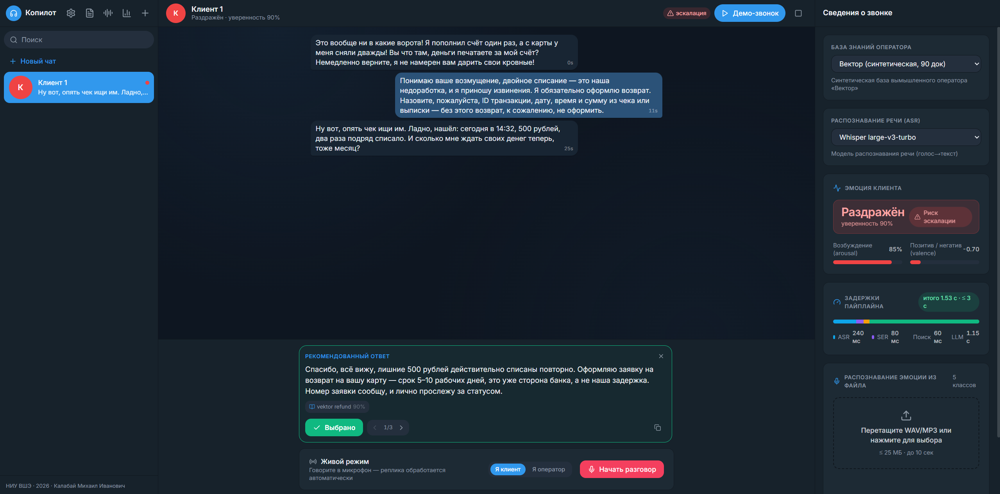
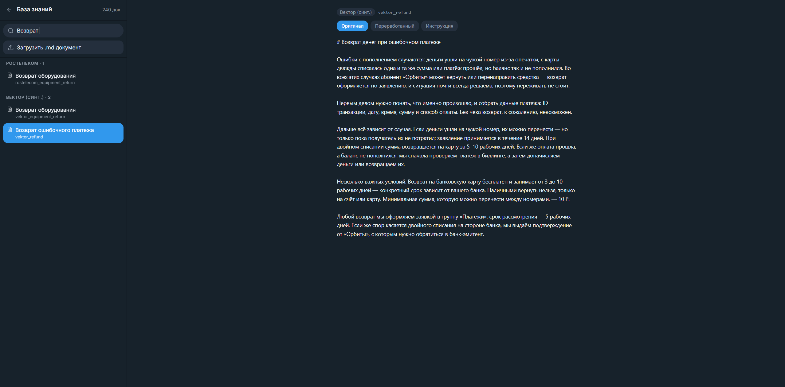
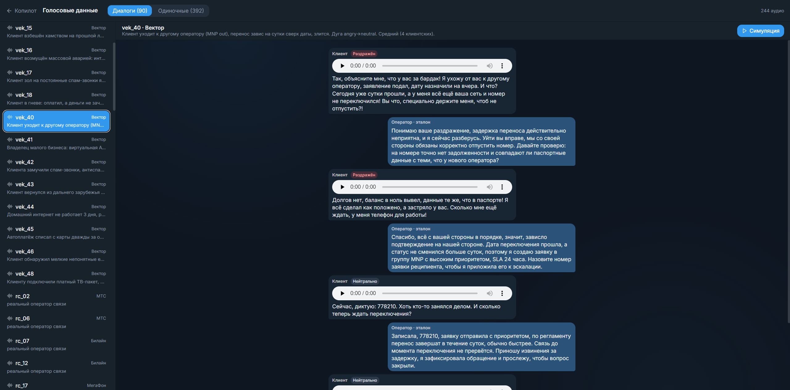
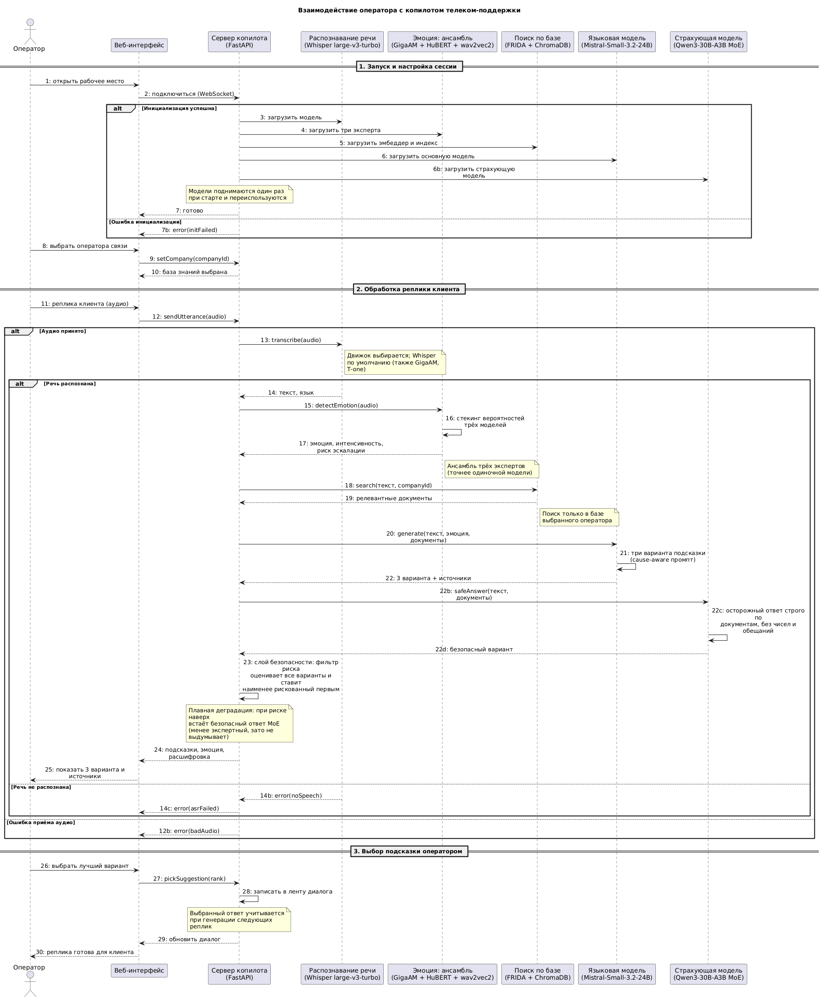
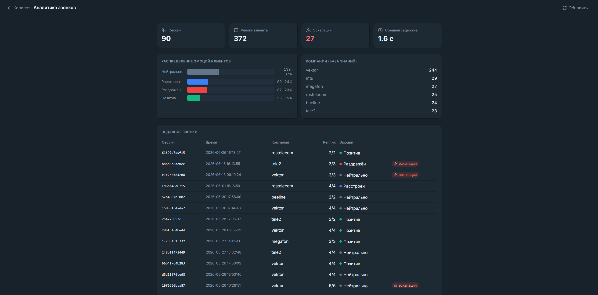

# Telecom Copilot

Помощник оператора телеком-поддержки. Слушает звонок, по голосу распознаёт речь и эмоцию клиента, ищет ответ в базе знаний оператора и подсказывает готовые варианты ответа с учётом настроения. Всё крутится локально на одной видеокарте 16 ГБ, без облака.



*Звонок про двойное списание. Система видит раздражение и риск эскалации (справа), оператор признаёт ошибку и оформляет возврат. Под каждой подсказкой стоит документ, из которого она взята.*

Факты берутся из базы, а не сочиняются. Тут срок возврата в ответе оператора пришёл из найденной статьи «Возврат ошибочного платежа»:



*Та самая статья. Любую подсказку можно открыть и сверить с источником.*

## Откуда данные

Готовых записей звонков в открытом доступе нет, так что данные собирал сам. База знаний собрана из открытых материалов поддержки реальных операторов и приведена к одному формату. Ещё есть синтетический оператор «Вектор», у него документов даже больше, чем у реальных. Темы у баз похожие, а детали разные, чтобы искать приходилось строго в своей базе.

Диалоги тоже синтетические: многоходовые разговоры, где клиент по ходу меняет настроение, и для каждой реплики заранее отмечено, какой документ правильный. Реплики клиента я озвучивал через ElevenLabs, на платной подписке, которая открывает доступ к их свежей модели eleven_v3. На сегодня это, наверное, самый реалистичный синтез эмоциональной речи на рынке, ближе всего к живому голосу.

Самое удобное в eleven_v3 в том, что интонацию задаёшь прямо в тексте метками: пишешь [furious][shouting] и голос реально звучит зло, [sad][sighs] делает грустно, и так далее. Кроме меток крутил стабильность голоса (чем ниже, тем выразительнее) и подбирал сам голос, всего семь русских. Так нагенерил больше пятисот реплик, около двух часов озвученных разговоров, и на них уже гоняется весь бенчмарк: распознавание речи, эмоции, поиск, подсказки. Аудио лежит в eval/audio, тексты в eval/e2e_dialogues.json, базы в data.



*Один диалог из бенчмарка: реплики клиента с распознанной эмоцией и озвучкой, и эталонные ответы оператора. По таким диалогам копилот и строится, и оценивается.*

## Как это устроено

Каждая реплика клиента проходит четыре шага, плюс сверху проверка на безопасность.

Сначала речь переводится в текст (Whisper large-v3-turbo, можно переключить на GigaAM или T-one). Параллельно по голосу определяется эмоция, причём по интонации, а не по словам: одна и та же фраза спокойного и злого клиента попадает в разные классы. Эмоцию считает ансамбль из трёх моделей (GigaAM, HuBERT, дообученная wav2vec2), он точнее любой одной. Дальше по тексту идёт поиск в базе именно выбранного оператора (FRIDA + ChromaDB), и языковая модель (Mistral-Small-3.2-24B, можно переключить на T-lite) пишет три варианта ответа с учётом эмоции и найденных документов.

Сверху работает безопасность. Ответы проверяются на опасные формулировки (обещания, выдуманные числа и сроки), и если рискованны все варианты, наверх встаёт ответ страхующей модели Qwen3-30B-A3B. Она отвечает сдержанно и почти не выдумывает, так что в худшем случае система скатывается к безопасному ответу, а не к выдумке. Выбор всё равно за оператором.



*Путь одной реплики, от звука до подсказок.*

## Демо-видео

Два коротких ролика, кликабельны:

«[Живой разговор](media/demo_live.mp4)»: говорю в микрофон, копилот на лету распознаёт речь и эмоцию и сам подсказывает ответы (обычная вкладка оператора).

«[Пример синтетики](media/demo_synthetic.mp4)»: прогон готовой озвученной записи с раздражённым голосом из бенчмарка, видно, как распознаётся эмоция.

## Качество

Качество подсказок я проверял отдельным сильным судьёй (другой моделью), плюс смотрел скорость и ещё несколько числовых метрик. Если совсем коротко: у лучшей локальной модели вышло около 71% хороших ответов при почти нуле вредных, а облачная Claude даёт 93% и служит потолком. Полные таблицы и разбор есть в тексте работы.

Ещё проверял, что эмоция реально влияет: брал одни и те же ответы с её учётом и без, и судья почти всегда выбирал вариант с эмоцией (у облачной модели в 99% случаев). Поэтому распознавание эмоции и вынесено в отдельный этап.



*Сводка по звонкам: эмоции, операторы, эскалации, задержки.*

## Стек

Речь в текст делает Whisper large-v3-turbo (или GigaAM, или T-one). Эмоцию по голосу считает ансамбль GigaAM + HuBERT + дообученная wav2vec2. Поиск на эмбеддере FRIDA и хранилище ChromaDB. Ответ пишет Mistral-Small-3.2-24B или T-lite через llama.cpp, плюс Qwen3-30B-A3B как страхующая. Бэкенд на FastAPI и WebSocket, фронт на Next.js и React. Всё помещается в 16 ГБ видеопамяти.

## Установка и запуск

Модели в репозиторий не входят, качаются сами при первом запуске. Бэкенд: `pip install -r requirements.txt` (Python 3.11 или 3.12). Фронт: `npm install` в папке frontend. Дальше:

```bash
python scripts/index_kb.py
uvicorn app.main:app --app-dir backend --host 127.0.0.1 --port 8000
cd frontend && npm run dev
```

Фронт поднимется на http://localhost:3001. Кнопка «Демо-звонок» проигрывает готовый озвученный пример без микрофона.

## Где что лежит

backend это пайплайн и API, frontend это интерфейс оператора, sdk это клиент для встраивания. Эксперименты и бенчмарк в eval, данные в data и eval/audio.

## Лицензия

Код под MIT (файл LICENSE). Модели и библиотеки идут под своими открытыми лицензиями.
